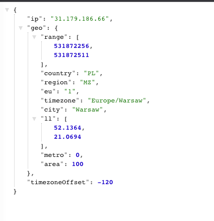
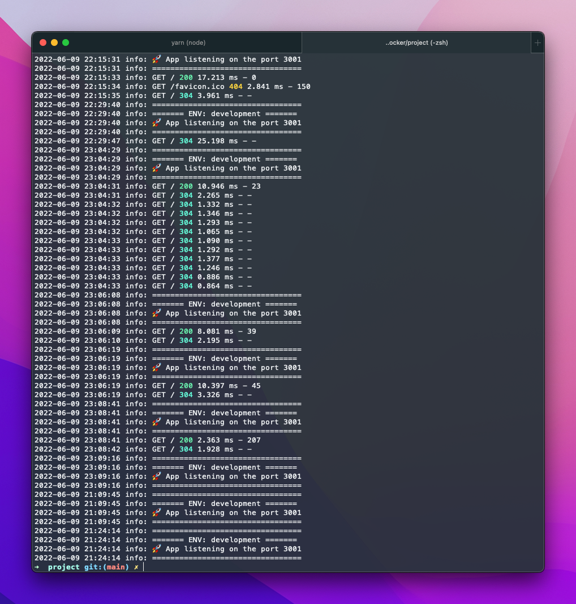
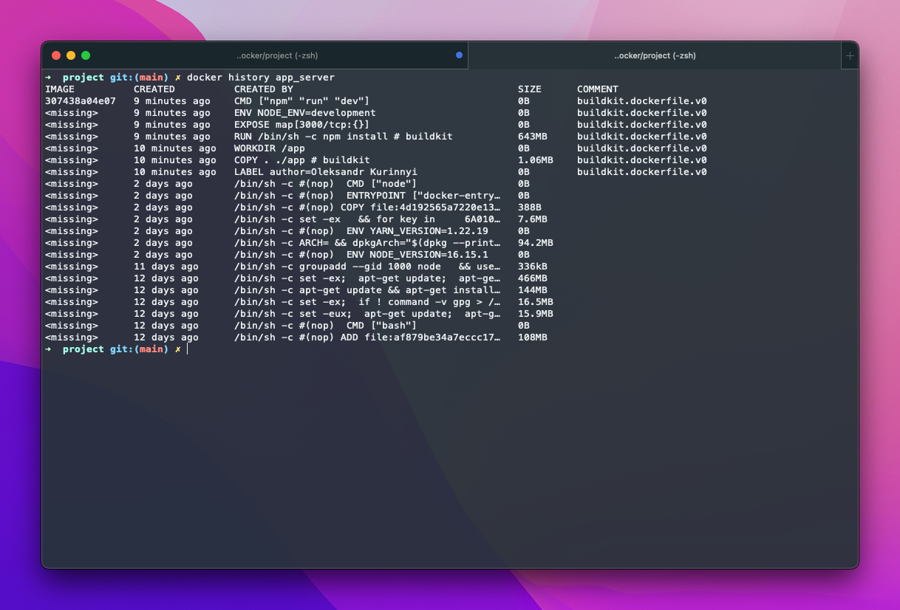

## Quick Overview

The backend is deployed here -
https://blooming-plateau-14609.herokuapp.com/



## Zadanie 1
```sh
docker-compose up -d
```

## Zadanie 2

```sh
# Common build stage

FROM node:16 as common-build-stage
LABEL author="Oleksandr Kurinnyi"

COPY . ./app

WORKDIR /app

RUN npm install

EXPOSE 3000

# Development build stage
FROM common-build-stage as development-build-stage

ENV NODE_ENV development

CMD ["npm", "run", "dev"]

# Production build stage
FROM common-build-stage as production-build-stage

ENV NODE_ENV production

CMD ["npm", "run", "start"]
```

## Zadanie 3

```sh
docker-compose --project-name app build
docker container run app_server
docker exec 2c376058afb4 cat src/logs/debug/2022-06-09.log
```



